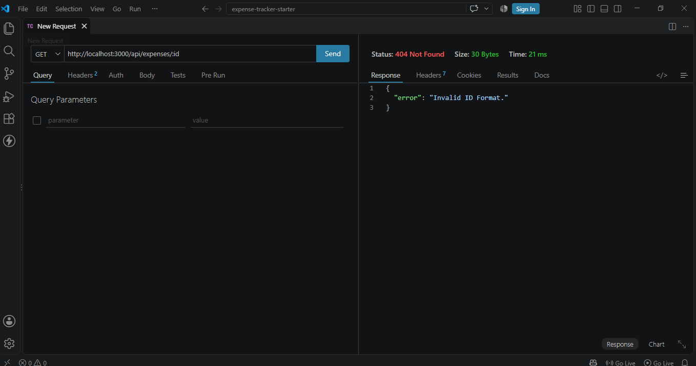
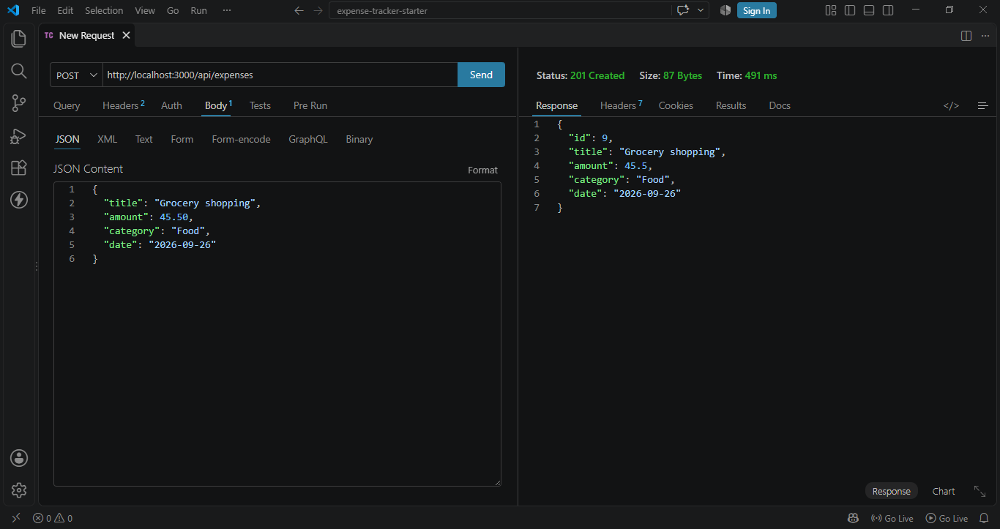
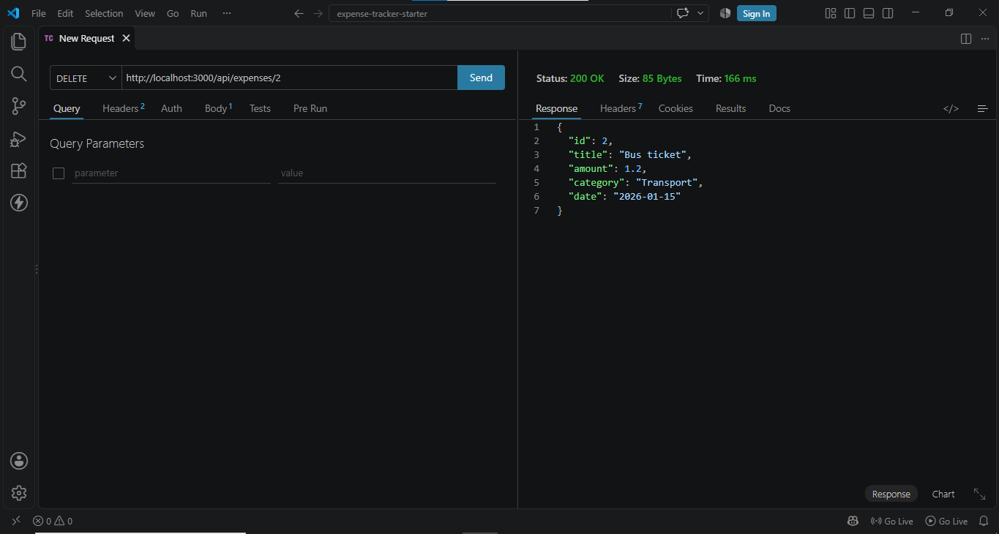

# Expense Tracker

<!-- Write 1-2 sentences: what does your app do? -->

## How to run

<!-- Write the exact steps someone needs to run your project from scratch.
     Assume they have Node.js, PostgreSQL, and VS Code, and nothing else.
     Include: creating the database, running schema.sql, writing the .env file,
     starting the backend, and opening the frontend. -->

**Backend**

1. ...

**Frontend**

1. ...

## Features

<!-- List what your app can do. Tick what you finished. -->

- [ ] Add an expense (with validation)
- [ ] Delete an expense
- [ ] Edit an expense
- [ ] Filter by category
- [ ] Summary cards (total, count, highest)
- [ ] Data is saved in a PostgreSQL database

## Screenshots

## Responsiveness Screenshots

## Sucess & Faliure Request Cases Screenshots

<!-- Add 2-3 screenshots of your app (desktop and mobile). -->

## What was the hardest part?

<!-- A short paragraph: what got you stuck, and how did you solve it? -->
