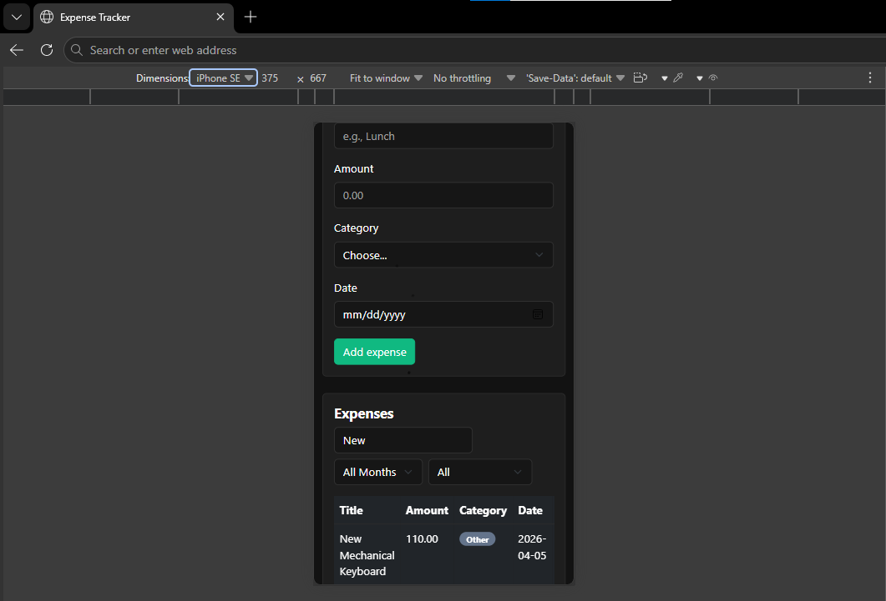
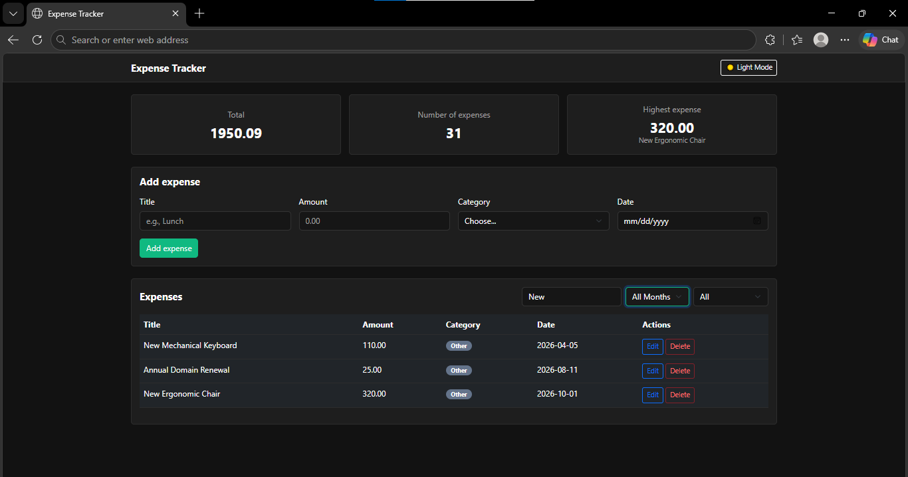
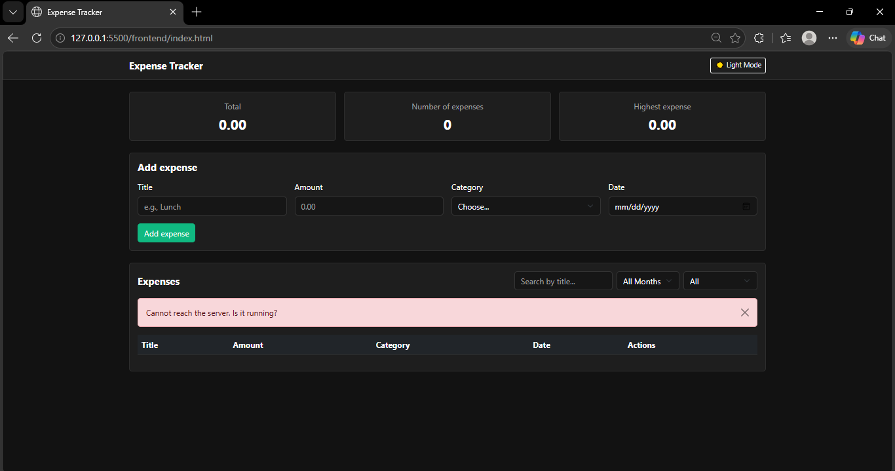
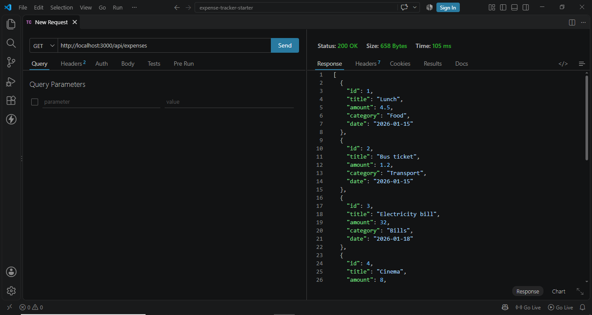
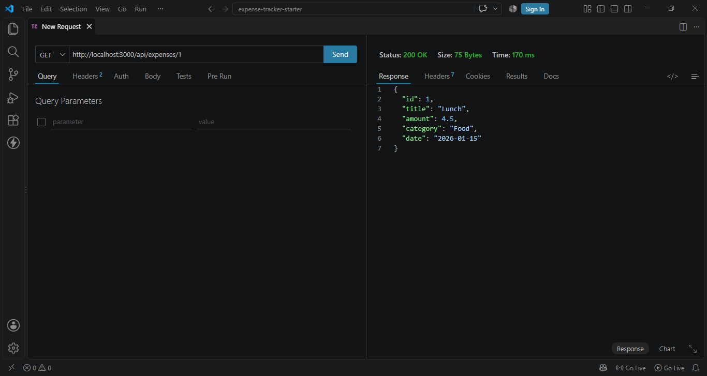
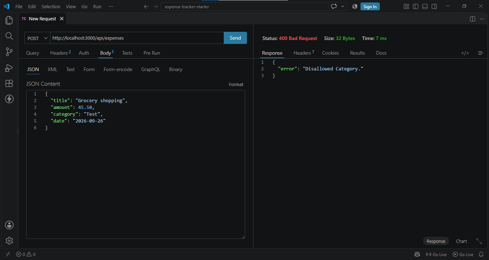
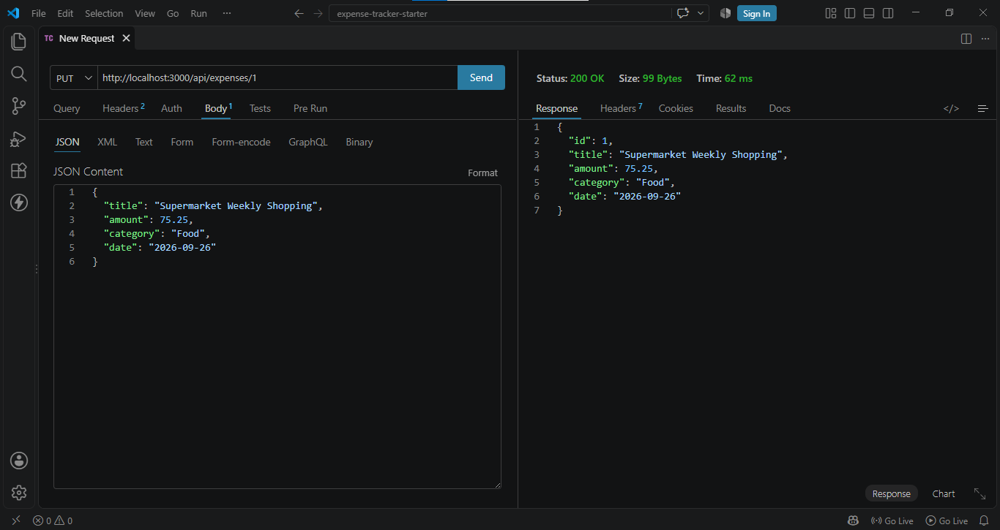
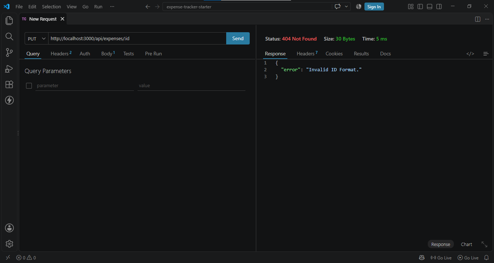
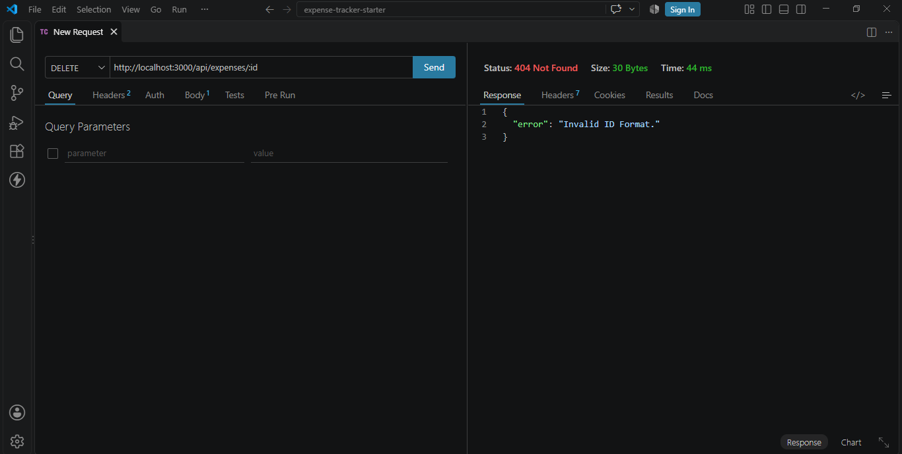

# Expense Tracker

**Repository**:

[github.com/alawnehlaith09/expenses-tracker-project](https://github.com/alawnehlaith09/expenses-tracker-project)

**Project Demo**:

https://drive.google.com/file/d/1UsJQVp7SX3jbAlEsJN1YxoWeIF96692q/view?usp=sharing

A full stack web app to track personal expenses, built with Node.js, Express, PostgreSQL, and JavaScript (no frontend framework, only Bootstrap for styling).

## How to run

### Backend

1. `cd backend`
2. `npm install`
3. Copy `.env.example` to a new file named `.env`, and add your PostgreSQL password
4. Create an empty database named `expense_tracker` in pgAdmin
5. Run `schema.sql` on it (creates the `expenses` table and some sample data)
6. `node server.js`
7. The server runs on `http://localhost:3000`

### Frontend

1. Open `frontend/index.html` with Live Server (make sure the backend is running first)
2. The page fetches real data from the API, there is no offline/sample mode

## Features

- Add an expense (title, amount, category, date), with validation on both the form and the server
- Edit an expense in a modal, connected to the server (PUT)
- Delete an expense, with a confirmation prompt first
- Filter by category, with an "All" option
- Search by title (live, as you type)
- Filter by month
- Summary cards: total amount, number of expenses, and highest expense (always based on all expenses, not the filtered list)
- Dark mode toggle, remembered between visits
- Loading spinner on every request, and clear error messages if something goes wrong or the server is off
- Responsive layout, works on phone screens too

## Screenshots

## Responsiveness Screenshots

## Success & Failure Request Cases Screenshots

## What was the hardest part?

The hardest part was remembering what each Bootstrap utility class does. There are so many of them, and without the documentation open I kept mixing them up.

However, I solved this by repetition and practice. The more I used them, the easier it became to remember.
